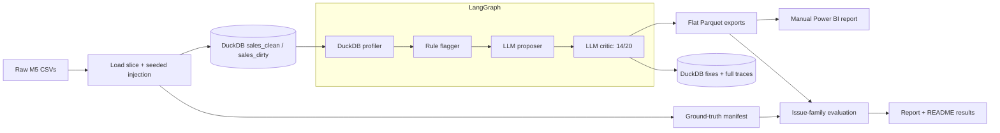

# retail-dq-agent

## What This Is

A Python data-quality workflow that loads an M5 Walmart sales slice into DuckDB,
injects seven named defects, and compares detected findings against a manifest.
Rules identify anomalies; an LLM proposes remediations and a second pass grades
them before review in a manually built Power BI report.

## Architecture



## How to Run

Python 3.11 and uv are required. Place `sales_train_evaluation.csv`,
`sell_prices.csv`, and `calendar.csv` in `data/raw/`. Copy `.env.example` to
`.env` and configure `OPENAI_API_KEY` before running the agent.

```bash
make setup
make inject
make run-agent
make eval
```

The loader retains CA_1, CA_2, TX_1, dates from 2015-01-01, and the top 200 items
ranked by total units in that slice (item ID breaks ties). Prices are left-joined
by store, item, and week. Injection seed is 42; the manifest records affected
source rows before the 500 verbatim duplicates are appended.
I3 moves prices into `price_usd` strictly after the source slice's median trading
date, computed before timezone changes and duplication; the manifest records
the actual cutoff.

`make run-agent` writes ordinary outputs and `outputs/powerbi/`. Use
`powerbi/model_notes.md` for the two-page manual report, six DAX measures, and
refresh instructions. No `.pbix` is generated. `make eval` prints a Rich table,
writes `eval/report.md`, and updates only the EVAL block below.

The default model is `gpt-4o-mini`, with proposer temperature 0.2 and critic
temperature zero. Configure `OPENAI_MODEL`, `OPENAI_TEMPERATURE`, and
`RETAIL_DQ_DB` in `.env`. `uv run python -m src.agent.graph run --no-critic`
explicitly bypasses review; these candidates are labeled bypassed rather than
approved. SQL is recorded for human review, never executed. Completed runs append
all candidates to DuckDB `fixes`, including rubric scores and serialized node
inputs/outputs plus per-anomaly model messages. Failed runs do not persist fixes.

## Results

The placeholders below are replaced only by evaluation of actual exported
candidates; mocked test results are not portfolio performance results. The
generated block records any missed injected issues.

<!-- EVAL:START -->
| Metric | Result |
| --- | --- |
| Recall | 100.0% (7/7) |
| Action precision | 57.1% (4/7) |

| Injected issue | Detected | Action correct | Critic passed | Proposed / expected action |
| --- | --- | --- | --- | --- |
| I1_null_units | yes | no | yes | investigate / impute |
| I2_duplicate_rows | yes | no | no | investigate / drop |
| I3_schema_drift_price | yes | yes | no | schema_fix / schema_fix |
| I4_out_of_range_price | yes | yes | yes | investigate / investigate |
| I5_negative_units | yes | yes | yes | investigate / investigate |
| I6_timezone_shift | yes | no | yes | investigate / normalize |
| I7_category_typos | yes | yes | yes | normalize / normalize |

Missed injected issues: none in this run.
<!-- EVAL:END -->

## Honest Limitations

**The "investigate" default (headline failure mode).** The proposer defaults to `investigate` on 3/7 injections — nulls, duplicates, and timezone drift — where a more specific action was warranted (`impute`, `drop`, `normalize`). This reflects LLM hedging under uncertainty: the model prefers a safe verb over a decisive one. The critic caught 1 of these (duplicates); the other two passed rubric because "investigate" scored well on grounding and safety. This is the single biggest driver of the 57.1% action precision.

**The critic's blind spot.** The rubric grades specificity, grounding, safety, and SQL validity. It does not grade decisiveness — a rationale that says "the source of these duplicates should be examined" passes all four gates. A v2 rubric would add a "commits to an action" dimension.

1. Category typo detection examines only the top five values. `I7_category_typos`
   may be missed if injected spellings are rarer than the dominant categories;
   the evaluation block names it as missed only if the actual run confirms that.
2. Price detection uses global column mean/stddev. It can miss item/store-specific
   errors when legitimate price variation inflates variance; it does not establish
   whether an outlier is a 100x entry error.
3. Timezone detection is a low-confidence suffix heuristic. It flags mixed strings
   but cannot prove that TX_1 is semantically shifted by six hours. Unparseable
   dates are recorded separately and do not count as detecting `I6_timezone_shift`.
4. Edit distance also flags legitimate nearby identifiers. Only a vocabulary or
   source reconciliation can distinguish typos from real category values.
5. Evaluation matches issue families, not affected rows. All candidates, including
   rejected ones, count toward detection; action precision measures exact manifest
   action agreement on detected issues, not false-positive finding precision.
   Conservative investigation can be reasonable but fail an expected impute/drop
   label. Zero-affected injections remain explicit in the recall denominator.
6. The critic is another LLM judgment, not a SQL parser or safety guarantee.
   Its 14/20 total can pass despite one weak rubric dimension. Fixes need human
   validation; full traces repeat profiles per candidate and increase storage.
7. Fixed seeds reproduce corruption, not byte-identical LLM output. API responses,
   run IDs, timestamps, latency, and model revisions can vary.

## Known deviations from spec

- **I3 cutoff date.** Prompt spec called for 2016-06-01 as the schema-drift cutoff. The M5 subset loaded by `load_raw()` doesn't extend past that date, so the injection uses the median date of `sales_dirty` at runtime to guarantee it lands. A production version would expand the date filter in `load_raw()` instead.
- **`injected_ground_truth`****&#x20;row count.** Contains 9 rows for 7 issues because I3 and I4 each span 2 columns (`sell_price` and `price_usd`). The `Coverage vs Ground Truth` Power BI measure uses `DISTINCTCOUNT(issue_id)` to collapse to 7.

## Demo

```bash
uv run python -m scripts.demo
```

The script rebuilds the clean slice, injects with seed 42, runs both model passes,
exports the report bundle, and evaluates it. It uses temperature zero, seed 42,
and the pinned `gpt-4o-mini-2024-07-18` snapshot. The console provides a 60-second
Loom narration sequence and elapsed stage timings. Run once before recording:
raw CSV ingestion and sequential API calls may take longer than 60 seconds;
the script reports actual elapsed time rather than claiming a hard time bound.
Tests use mocked models: `uv run pytest`.

## Verify the Pipeline

Run verification with the uv-managed Python environment:

```bash
uv run python scripts/verify_pipeline.py
```

Alternatively, from the project root run `./scripts/verify_pipeline.py`; its
shebang selects `uv run python`. Avoid bare `python scripts/verify_pipeline.py`,
which may select a base conda interpreter without the project dependencies.
Verification removes the generated database, Parquet files, and evaluation
report, preserves raw CSVs and the manifest, then runs all four make steps and
hard-checks outputs. Per-step stdout/stderr is captured in `logs/verify_*.log`;
exit status is zero only when every check passes.

## Cost Note

As checked on 2026-09-18, standard `gpt-4o-mini` pricing is $0.15 per million
input tokens and $0.60 per million output tokens
([official model pricing](https://developers.openai.com/api/docs/models/gpt-4o-mini)).
For an illustrative run of 20 anomalies, two calls each, averaging 1,000 input
and 300 output tokens per call, the rough cost is **$0.0132 per run**:
`40 * (1000 * 0.15 + 300 * 0.60) / 1_000_000`.
This is a budgeting example, not a measured bill. Actual cost depends on anomaly
count, prompt length, retries, model choice, and cache discounts; token usage is
not currently collected for billing reconciliation.
